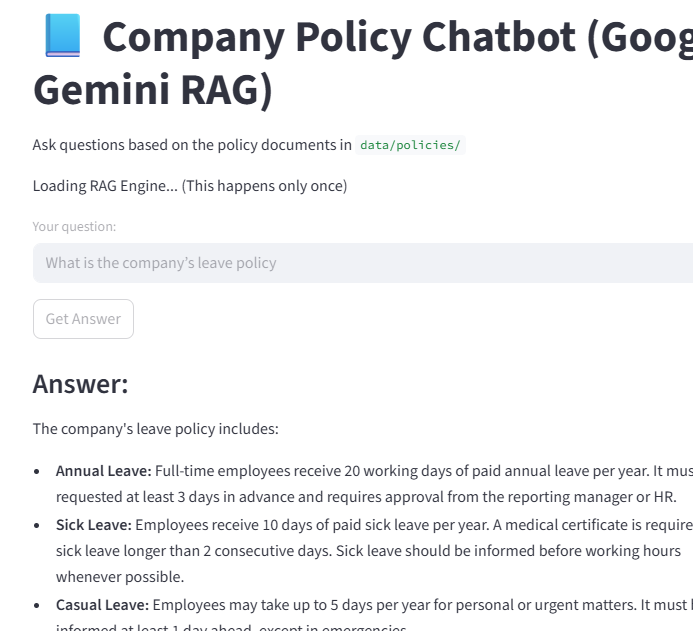

# HR & Company Policy Chatbot – Advanced RAG System with Google Gemini

[](https://www.python.org/)
[](https://streamlit.io/)
[](https://ai.google.dev/)
[](https://en.wikipedia.org/wiki/Retrieval-augmented_generation)
[](https://opensource.org/licenses/MIT)

**A production-oriented Retrieval-Augmented Generation (RAG) chatbot** that answers questions about company/HR policies directly from your internal PDF/text documents — with **source citations**, **hallucination mitigation**, and a clean interactive interface.

Built as a strong portfolio project to demonstrate hands-on expertise in **RAG pipelines**, **LLM integration**, **vector search**, **document ingestion**, and **deployable AI applications** — perfect for Mid-Level AI Engineer roles.

### Live Demo Screenshot (Example Interaction)

Here’s how the chatbot looks and responds in action:

<p align="center">
  <a href="images/img.png"></a>
</p>

> The company's leave policy includes:  
> • **Annual Leave**: Full-time employees receive 20 working days of paid annual leave per year. Must be requested at least 3 days in advance and requires approval from the reporting manager or HR.  
> • **Sick Leave**: Employees receive 10 days of paid sick leave per year. A medical certificate is required for sick leave longer than 2 consecutive days. Sick leave should be informed before working hours whenever possible.  
> • **Casual Leave**: Employees may take up to 5 days per year for personal or urgent matters. It must be informed at least 1 day ahead, except in emergencies.

### ✨ Key Features

- **Grounded & Accurate Responses** — Strictly uses content from your policy documents only
- **Source Citations with Metadata** — Displays document name, chunk ID, and similarity score for full traceability
- **Anti-Hallucination Safeguards** — Strict prompt forces "I cannot find this information" when context is missing
- **Flexible Document Support** — Handles both `.pdf` and `.txt` files
- **Interactive & User-Friendly** — Beautiful chat interface built with Streamlit
- **Modular Design** — Easy to extend (memory, hybrid search, different LLMs/DBs)

### Tech Stack

| Category              | Tools & Technologies                              |
|-----------------------|---------------------------------------------------|
| Language              | Python 3.10+                                      |
| UI/Framework          | Streamlit                                         |
| LLM                   | Google Gemini 2.5 Flash / Pro                     |
| Embeddings            | Google `text-embedding-004`                       |
| Vector Database       | FAISS (Flat L2 Index)                             |
| Document Processing   | PyPDF2                                            |
| Others                | NumPy, pickle, python-dotenv                      |

### Project Structure

```text
Chatbox-HR-Policy/
├── data/
│   └── policies/               # ← Put your HR/Company policy PDFs or .txt files here
├── models/                     # Auto-generated: FAISS index + metadata (gitignored)
├── .venv/                      # Virtual environment (gitignored)
├── app.py                      # Main Streamlit chat application
├── ingest.py                   # Document loader, chunker, embedder & FAISS builder
├── rag_utils.py                # Core RAG engine (retrieval + prompt + generation)
├── config.py                   # Gemini configuration & API setup
├── requirements.txt            # All dependencies
├── .env                        # Your GEMINI_API_KEY (gitignored)
├── .gitignore
└── README.md